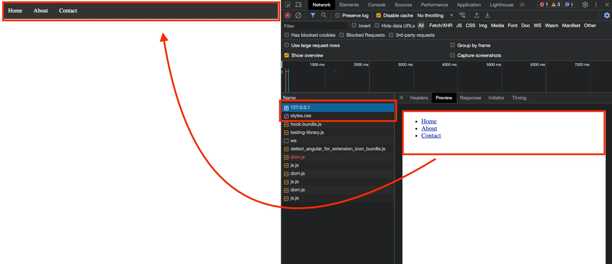
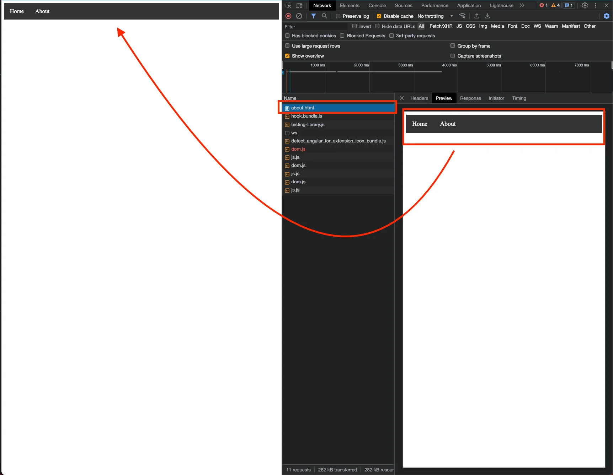
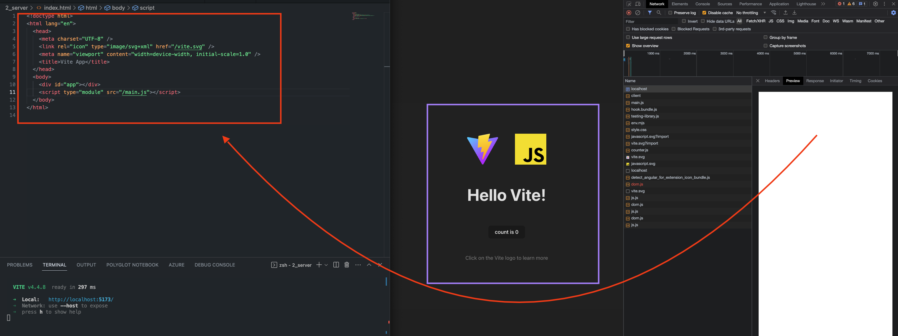
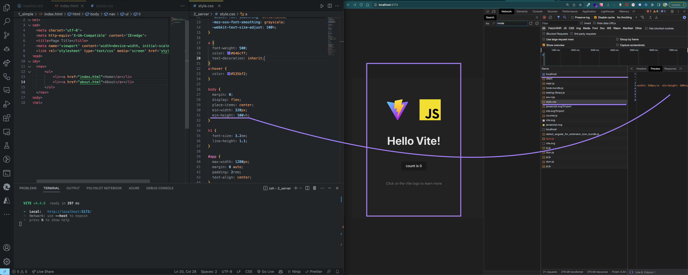
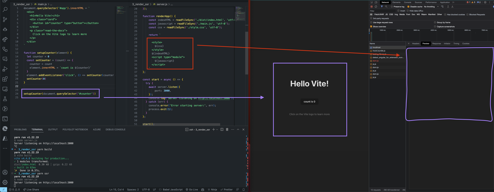
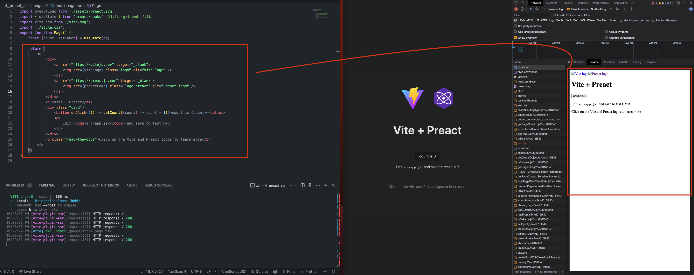
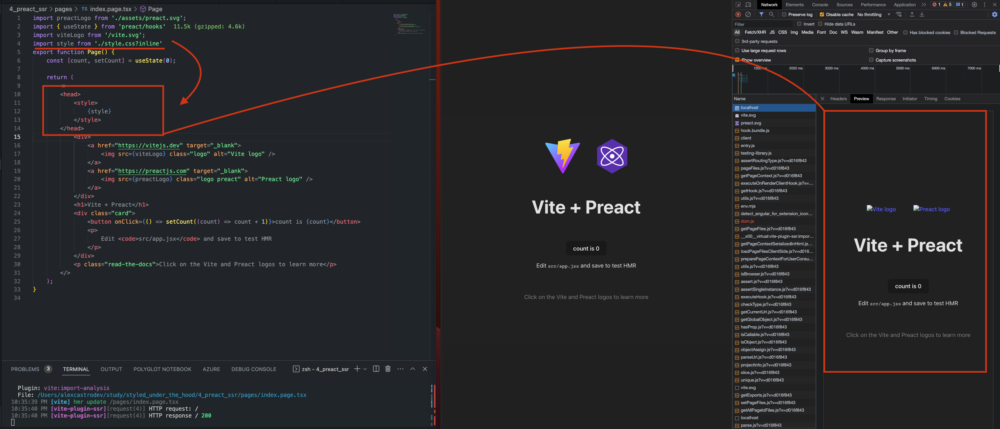
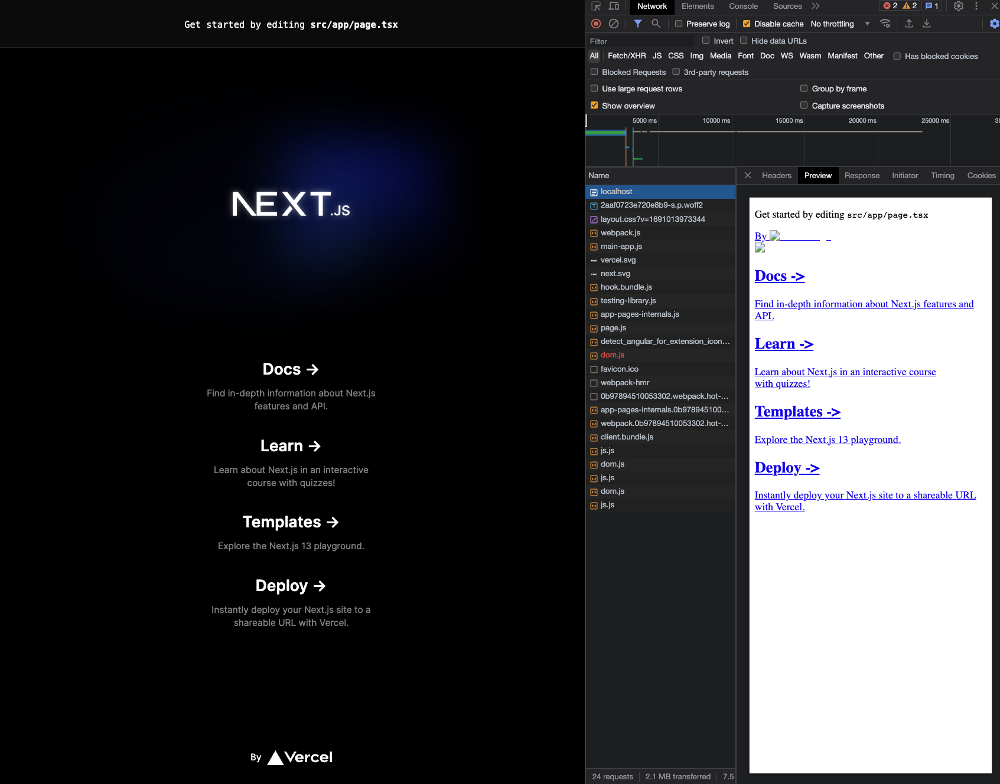
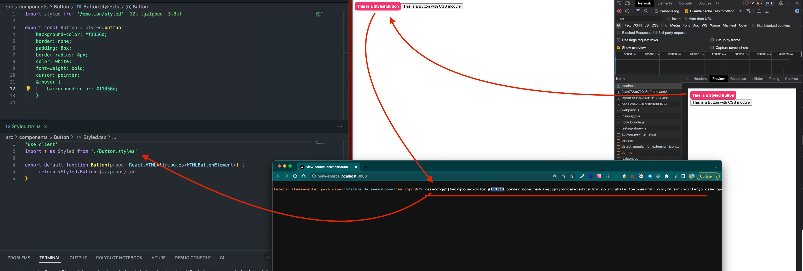

# Introduction

Lately, i receive some question about: how does Styled components works ? Why Styled is still not working in Server Components ? And so on...

So i decided to start this repository to bring some answers to these questions.

When we use `<link>` and refer to a css file, the browser will download the css file and apply the styles to the page.

You can see this behavior in the `1_simple/index.html` file.



The result: 

The page will render without styles, and after the browser download the css file, the styles will be applied to the page.

----

When we use `<style>` tag, the browser will apply the styles to the page.

You can see this behavior in the `1_simple/about.html` file.



The result:
The page will render with styles.

Is that the solution ? No, because we will have a lot of `<style>` tags in our html file, and this is not a good practice.

----

Before start talking about styled-components, let's talk start a new example:

You can browse the `2_clientside_render` folder, and run:

```bash
yarn
``` 

To start the server:

```bash
yarn dev
```

In the image below, you can see that first the browser will render the page without content.
Of course, our index.html file just have a `<div id="app"></div>`.



After the browser download the javascript file, the page will be rendered with the content.



Even after build, you can see something like that:

```html
<!doctype html>
<html lang="en">
  <head>
    <script type="module" crossorigin src="/assets/index-44b5bae5.js"></script>
    <link rel="stylesheet" href="/assets/index-48a8825f.css">
  </head>
  <body>
    <div id="app"></div>
  </body>
</html>
```

Conclusion about this: The browser will render the page without content, and after the javascript file is downloaded, the page will be rendered with the content.


----

Let's make it more interesting, i will copy the `2_render_csr` folder to `3_render_ssr`

After this, i will create a server.js to read dist folder and serve the files to the browser with server side rendering.

I had to add:

- Fastify (server)
- @fastify/static (to serve the files)

In this point, the behaviour is the same, the browser will render the page without content, and after the javascript file is downloaded, the page will be rendered with the content.

let's fix this:

I will remove some assets, because i need a the DOM Tree, chunks, etc... so i will only have the counter component and css preloaded.



At this point, the purple one shows the content that will be rendered in the browser, and the red one shows the content that will be rendered in the server.

Conclusion: The browser will render the page without content, and after the javascript file is downloaded, the page will be rendered with the content. But the styles will be applied in the server.

---------

To make it easier, let's use preact with SSR support.

lets browse the `4_preact_ssr` folder, run:

let's run:

```bash
yarn
yarn ssr
```



Wow, thats awesome, the page will be rendered with the content by the server side. And if you are paying attencion until now, the only thing that is missing here is the styles.

so let's add this on server side also. The POOR way to do that is injecting inline styles in the html file.



Conclusion: at this point, we understand how browser works, and how to render the page with CONTENT AND STYLE in the server side.

But, WHEN WE GONNA TALK ABOUT STYLED COMPONENTS ?

Right now, my baby padawan.

---

``````
Just a disclaimer:
1 - Styled components and SSR is not a good idea, because the styles will be injected in the html file, and this will make the file bigger, and the browser will take more time to download the file.

2 - Start to learn and use css modules, tailwind, etc... because you will not have a headache with SSR. Runtime styles is not a good idea for meta-framework today.
``````

Let's browse the `5_styled_components` folder, run:

```bash
yarn
yarn dev
```

Note: Even using tailwind, the page will be rendered without styles.



But remember, we need to have a solid understanding about how the browser works.

How it works under the hood, or the basic things.

In this point, i will not fix whole page, but i will create 2 different component that will be rendered in the server side.

The first component will be rendered with styles, and the second will be rendered without styles.



The tradeoff here using `styled-component`:

1 - When we use styled components, the styles will be injected in the html file, and this will make the file bigger, and the browser will take more time to download the file.

2 - You must use "use client". This could be confused to have "use server" here, and client there, etc...

```
if you remove the "use client" directive, you will see this error:

Error: createContext only works in Client Components. Add the "use client" directive at the top of the file to use it. Read more: https://nextjs.org/docs/messages/context-in-server-component
```

Conclusion: styled components is not a good idea for SSR. The [G]OLD way to do that is using css modules ou scss.

You will notice that downlowding the css file is faster than download the javascript file.

The css is too small and just download what you are using, not the whole styles resources.


If you are using emotion today, because you need to use css in js ( mantine or Material UI ), no problem. Dont worry about that.

Hype comes and goes, but the basics will be always the same.

```
"Tools cannot change how browser works, only make it easier to do something."
    - Castro, Alexandro (aka me)
```

Note:
```
In a Next.js discussion, there is a comment that talk about experimental features, and one of them is `optimizeCss`, so let's try this. 

They use this package: 
https://www.npmjs.com/package/critters

This package will extract the critical css and inject in the html file.

I really think this have issues yet, so i will not use this approach.
```

references:

https://fastify.dev

https://github.com/fastify/fastify-static

https://preactjs.com/guide/v10/getting-started

https://shubhamverma.me/blog/server-side-rendering-of-tailwind-css-styles-in-next-js

https://blog.mikelramos.com/posts/optimizing-css-delivery-nextjs

https://github.com/vercel/next.js/discussions/12868

https://nextjs.org/docs/app/building-your-application/styling/css-modules